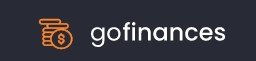
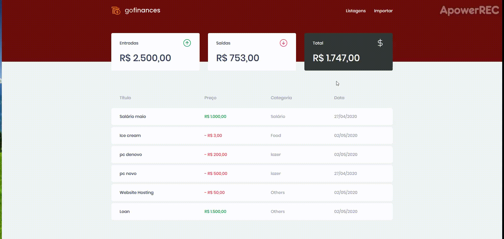

<h1 align= "center">
  
</h1>

<h1>
  
</h1>


# Indice
- [Sobre](#-sobre)
- [Tecnologias Utilizadas](#-tecnoogias-utilizadas)
- [Como Utilizar](#-como-utilizar-este-projeto)

---
## 🚧 Sobre

O projeto **GoFinances** foi desenvolvido como um desafio final do módulo de primeiros projetos utlizando ReactJs do **Bootcamp GoStack**.

---

## 🖥 Tecnologias Utilizadas

O projeto desenvolvido utilizando:
- ReactJS
- Axios
- TypeScript
- Integração com o [BackEnd](https://github.com/VictorCmelo/bootcamp-desafio-05) em NodeJS

---

##  🎮 Como Utilizar este projeto

```bash

# Clonar orepositório
$ git clone https://github.com/VictorCmelo/bootcamp-desafio-06.git

# Entrar no diretório
$ cd bootcamp-desafio-06

# Instalar as dependências
$ yarn install

# Iniciar o projeto
$ yarn start

```
